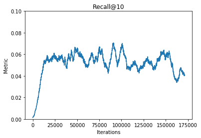

# CF STEP - Incremental Collaborative Filtering
> Incremental learning for recommender systems


CF STEP is an open-source library, written in python, that enables fast implementation of incremental learning recommender systems. The library is a by-product of the research project [CloudDBAppliance](https://clouddb.eu/).

## Install

Run `pip install cf-step` to install the library in your environment.

## How to use

For this example, we will use the popular [movielens](https://grouplens.org/datasets/movielens/) dataset. The dataset has collected and made available rating data sets from the [MovieLens](http://movielens.org) web site. The data sets were collected over various periods of time, depending on the size of the set.

First let us load the data in a pandas `DataFrame`. We assume that the reader has downloaded the 1m movielense dataset and have unziped it in the `/tmp` folder.

> To avoid creating a user and movie vocabularies we turn each user and movie to a categorical feature and use the pandas convenient cat attribute to get the codes

```python
# local

# load the data
col_names = ['user_id', 'movie_id', 'rating', 'timestamp']
ratings_df = pd.read_csv('/tmp/ratings.dat', delimiter='::', names=col_names, engine='python')

# transform users and movies to categorical features
ratings_df['user_id'] = ratings_df['user_id'].astype('category')
ratings_df['movie_id'] = ratings_df['movie_id'].astype('category')

# use the codes to avoid creating separate vocabularies
ratings_df['user_code'] = ratings_df['user_id'].cat.codes.astype(int)
ratings_df['movie_code'] = ratings_df['movie_id'].cat.codes.astype(int)

ratings_df.head()
```


<div>
<style scoped>
    .dataframe tbody tr th:only-of-type {
        vertical-align: middle;
    }

    .dataframe tbody tr th {
        vertical-align: top;
    }

    .dataframe thead th {
        text-align: right;
    }
</style>
<table border="1" class="dataframe">
  <thead>
    <tr style="text-align: right;">
      <th></th>
      <th>user_id</th>
      <th>movie_id</th>
      <th>rating</th>
      <th>timestamp</th>
      <th>user_code</th>
      <th>movie_code</th>
    </tr>
  </thead>
  <tbody>
    <tr>
      <th>0</th>
      <td>1</td>
      <td>1193</td>
      <td>5</td>
      <td>978300760</td>
      <td>0</td>
      <td>1104</td>
    </tr>
    <tr>
      <th>1</th>
      <td>1</td>
      <td>661</td>
      <td>3</td>
      <td>978302109</td>
      <td>0</td>
      <td>639</td>
    </tr>
    <tr>
      <th>2</th>
      <td>1</td>
      <td>914</td>
      <td>3</td>
      <td>978301968</td>
      <td>0</td>
      <td>853</td>
    </tr>
    <tr>
      <th>3</th>
      <td>1</td>
      <td>3408</td>
      <td>4</td>
      <td>978300275</td>
      <td>0</td>
      <td>3177</td>
    </tr>
    <tr>
      <th>4</th>
      <td>1</td>
      <td>2355</td>
      <td>5</td>
      <td>978824291</td>
      <td>0</td>
      <td>2162</td>
    </tr>
  </tbody>
</table>
</div>


Using the codes we can see how many users and movies are in the dataset.

```python
# local
n_users = ratings_df['user_code'].max() + 1
n_movies = ratings_df['movie_code'].max() + 1

print(f'There are {n_users} unique users and {n_movies} unique movies in the movielens dataset.')
```

    There are 6040 unique users and 3706 unique movies in the movielens dataset.


We will sort the data by Timestamp so as to simulate streaming events.

```python
# local
data_df = ratings_df.sort_values(by='timestamp')
```

The `Step` model supports only positive feedback. Thus, we will consider a rating of 5 as positive feedback and discard any other. We want to identify likes with `1` and dislikes with `0`.

```python
# local
# more than 4 -> 1, less than 5 -> 0
data_df['preference'] = np.where(data_df['rating'] > 4, 1, 0)
# keep only ones and discard the others
data_df_cleaned = data_df.loc[data_df['preference'] == 1]

data_df_cleaned.head()
```


<div>
<style scoped>
    .dataframe tbody tr th:only-of-type {
        vertical-align: middle;
    }

    .dataframe tbody tr th {
        vertical-align: top;
    }

    .dataframe thead th {
        text-align: right;
    }
</style>
<table border="1" class="dataframe">
  <thead>
    <tr style="text-align: right;">
      <th></th>
      <th>user_id</th>
      <th>movie_id</th>
      <th>rating</th>
      <th>timestamp</th>
      <th>user_code</th>
      <th>movie_code</th>
      <th>preference</th>
    </tr>
  </thead>
  <tbody>
    <tr>
      <th>999873</th>
      <td>6040</td>
      <td>593</td>
      <td>5</td>
      <td>956703954</td>
      <td>6039</td>
      <td>579</td>
      <td>1</td>
    </tr>
    <tr>
      <th>1000192</th>
      <td>6040</td>
      <td>2019</td>
      <td>5</td>
      <td>956703977</td>
      <td>6039</td>
      <td>1839</td>
      <td>1</td>
    </tr>
    <tr>
      <th>999920</th>
      <td>6040</td>
      <td>213</td>
      <td>5</td>
      <td>956704056</td>
      <td>6039</td>
      <td>207</td>
      <td>1</td>
    </tr>
    <tr>
      <th>999967</th>
      <td>6040</td>
      <td>3111</td>
      <td>5</td>
      <td>956704056</td>
      <td>6039</td>
      <td>2895</td>
      <td>1</td>
    </tr>
    <tr>
      <th>999971</th>
      <td>6040</td>
      <td>2503</td>
      <td>5</td>
      <td>956704191</td>
      <td>6039</td>
      <td>2309</td>
      <td>1</td>
    </tr>
  </tbody>
</table>
</div>


Following, let us initialize our model.

```python
# local
net = SimpleCF(n_users, n_movies, factors=128, mean=0., std=.1)
objective = lambda pred, targ: targ - pred
optimizer = SGD(net.parameters(), lr=0.06)
device = 'cuda' if torch.cuda.is_available() else 'cpu'

model = Step(net, objective, optimizer, device=device)
```

Finally, let us get 20% of the data to fit the model for bootstrapping and create the Pytorch Dataset that we will use.

```python
# local
pct = int(data_df_cleaned.shape[0] * .2)
bootstrapping_data = data_df_cleaned[:pct]
```

We will create a dataset from our Dataframe. We extract four elements:

* The user code
* The movie code
* The rating
* The preference

```python
# local
features = ['user_code', 'movie_code', 'rating']
target = ['preference']

data_set = TensorDataset(torch.tensor(bootstrapping_data[features].values), 
                         torch.tensor(bootstrapping_data[target].values))
```

Create the Pytorch DataLoader that we will use. Batch size should always be `1` for online training.

```python
# local
data_loader = DataLoader(data_set, batch_size=512, shuffle=False)
```

Let us now use the *batch_fit()* method of the *Step* trainer to bootstrap our model. 

```python
# local
model.batch_fit(data_loader)
```

    100%|██████████| 89/89 [00:01<00:00, 63.79it/s]


Then, to simulate streaming we get the remaining data and create a different data set.

```python
# local
data_df_step = data_df_cleaned.drop(bootstrapping_data.index)
data_df_step = data_df_step.reset_index(drop=True)
data_df_step.head()

# create the DataLoader
stream_data_set = TensorDataset(torch.tensor(data_df_step[features].values), 
                                torch.tensor(data_df_step[target].values))
stream_data_loader = DataLoader(stream_data_set, batch_size=1, shuffle=False)
```

Simulate the stream...

```python
# local
k = 10 # we keep only the top 10 recommendations
recalls = []
known_users = []

with tqdm(total=len(stream_data_loader)) as pbar:
    for idx, (features, preferences) in enumerate(stream_data_loader):
        itr = idx + 1
        
        user = features[:, 0]
        item = features[:, 1]
        rtng = features[:, 2]
        pref = preferences
        
        if user.item() in known_users:
            predictions = model.predict(user, k)
            recall = recall_at_k(predictions.tolist(), item.tolist(), k)
            recalls.append(recall)
            model.step(user, item, rtng, pref)
        else:
            model.step(user, item, rtng, pref)
            
        known_users.append(user.item())
        pbar.update(1)
```

    100%|██████████| 181048/181048 [13:03<00:00, 231.12it/s]


Last but not least, we visualize the results of the recall@10 metric, using a moving average window of 5k elements. 

```python
# local
avgs = moving_avg(recalls, 5000)

plt.title('Recall@10')
plt.xlabel('Iterations')
plt.ylabel('Metric')
plt.ylim(0., .1)
plt.plot(avgs)
plt.show()
```





Finally, save the model's weights.

```python
# local
model.save(os.path.join('artefacts', 'positive_step.pt'))
```

## References

1. Vinagre, J., Jorge, A. M., & Gama, J. (2014, July). Fast incremental matrix factorization for recommendation with positive-only feedback. In International Conference on User Modeling, Adaptation, and Personalization (pp. 459-470). Springer, Cham.
2. Hu, Y., Koren, Y., & Volinsky, C. (2008, December). Collaborative filtering for implicit feedback datasets. In 2008 Eighth IEEE International Conference on Data Mining (pp. 263-272). Ieee.
